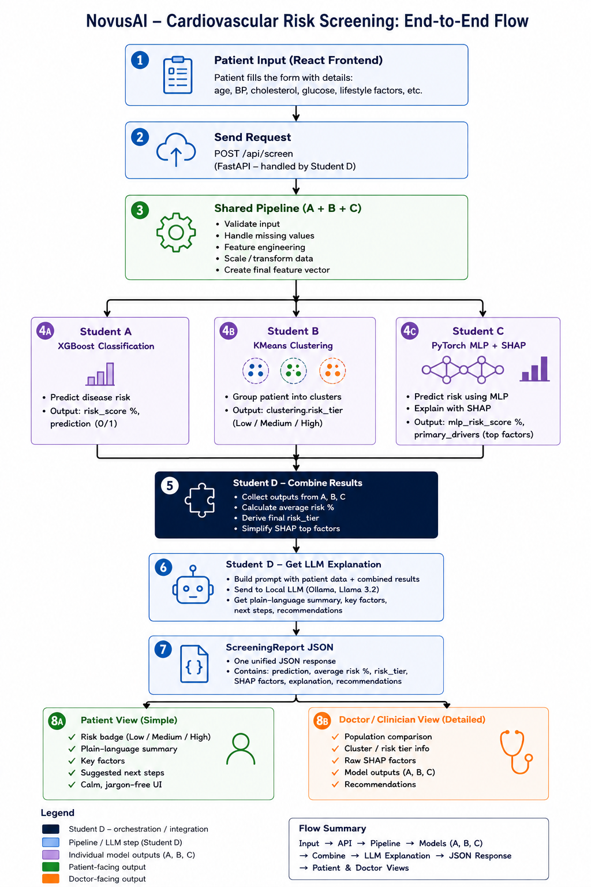

# NovusAI — Cardiovascular Disease Risk Screening

An AI-assisted screening web application that helps doctors and clinic staff assess a patient's cardiovascular risk in minutes and explains the result in plain, non-diagnostic language — built especially for rural clinics with limited access to specialists.

**Course:** AI/ML Capstone Project — Parul University & TelcoLearn, 2027 Batch
**Domain:** Healthcare
**Dataset:** [Cardiovascular Disease Dataset (Kaggle)](https://www.kaggle.com/datasets/sulianova/cardiovascular-disease-dataset) — 70,000 patient records, 11 clinical features

---

## 1. Problem Statement

Build a web application that accepts a patient's clinical measurements (age, blood pressure, cholesterol, BMI, smoking status) and outputs a personalised cardiovascular disease risk score with an explanation of the top contributing factors — targeted at primary healthcare workers who lack specialist access.

---

## 2. Team & Sub-problems

| Student | Sub-problem | Technique | App Component / Code File |
|---|---|---|---|
| **Student A** | Predict CVD risk (binary classification) using Logistic Regression, Random Forest, XGBoost. Tune decision threshold for high recall. | Supervised classification, GridSearchCV, AUC-ROC | `supervised.py` (XGBoost Classifier) |
| **Student B** | Cluster patients into risk tiers using K-Means. Profile each tier's clinical characteristics. | Unsupervised clustering, GMM, Silhouette scores | `clustering.py` (K-Means & GMM Models) |
| **Student C** | Build a PyTorch MLP with BatchNorm and Dropout. Compare Adam vs SGD convergence. Implement SHAP for feature attribution. | Deep learning, explainability, SHAP TreeExplainer | `deep_learning.py` (PyTorch MLP Network) |
| **Student D** | Prompt-engineer an LLM to translate the models' risk score and SHAP values into a plain-language clinical summary. Deploy full stack. | LLM integration, API orchestration, deployment | `main.py` / `llm_service.py` |

---

## 3. End-to-End Flow Chart

Below is the architectural diagram showing the data flow through each component of NovusAI:



**In short:** the patient form submits to a single orchestrator endpoint (`POST /api/screen`), which triggers model predictions. It queries XGBoost (Student A), PyTorch MLP (Student C), and K-Means/GMM clustering (Student B), merges the classification outcomes into a single consensus risk percentage, calculates SHAP feature attributions, and forwards them to a local Ollama LLM (Student D) to compile the final JSON report.

---

## 4. How Each Student's Work Fits Together

### Student A — Classification (XGBoost)
* **Code Implementation**: `supervised.py`
* **Work**: Trained and tuned binary classification models (Logistic Regression, Random Forest, XGBoost) to predict cardiovascular disease markers. XGBoost was chosen as the primary model. The classifier threshold is tuned specifically to optimize recall to prevent false negatives in patient screenings. Returns the risk probability score.

### Student B — Clustering (K-Means & GMM)
* **Code Implementation**: `clustering.py`
* **Work**: Segments patients into Low, Moderate, or High-risk cohorts using a 5-file clustering model package:
  - `cluster_features.pkl`: Defines the 13 feature schema inputs.
  - `kmean_scaler.pkl`: StandardScaler fitted specifically for the clustering pipeline.
  - `kmeans_model.pkl`: Predicts hard cluster categorizations.
  - `gmm_model.pkl`: Gaussian Mixture Model computing soft-clustering probability breakdowns.
  - `risk_mapping.pkl`: Maps predicted cluster indices straight to risk labels.
* **Feature Engineering**: Implements derived feature calculations (`age_years`, `pulse_pressure`, `bp_ratio`).

### Student C — Deep Learning + Explainability (PyTorch MLP + SHAP)
* **Code Implementation**: `deep_learning.py` & `supervised.py`
* **Work**: Built a PyTorch Multi-Layer Perceptron neural network (`CVDRiskMLP`) with three hidden layers, Batch Normalization, and Dropout layers for non-linear risk evaluations. SHAP force calculations are executed on the primary XGBoost classifier to isolate and map the top patient-specific clinical risk drivers.

### Student D — Integration, LLM, Deployment
* **Code Implementation**: `main.py` & `llm_service.py`
* **Work**: Orchestrates the backend API, averages classifier risk scores into a unified `final_risk_pct` to guarantee display consistency, and prompt-engineers a local Ollama instance running `llama3.2:3b` to translate metrics and SHAP values into an empathetic plain-language summary for patients. It implements a robust offline fallback to ensure continuous operability if Ollama is unreachable.

---

## 5. Tech Stack

| Layer | Technology |
|---|---|
| Frontend | React, React Three Fiber (3D heart canvas) |
| Backend | FastAPI |
| Classification | XGBoost, Logistic Regression, Random Forest (scikit-learn) |
| Clustering | K-Means & GMM (scikit-learn) |
| Deep Learning | PyTorch |
| Explainability | SHAP |
| LLM | Ollama (Llama 3.2 3B, local/free) |
| Deployment | Render |

---

## 6. Project Structure

```
cardiovascular-risk-screening-system/
├── README.md
├── flowchart.png                     # End-to-End System Flow Chart
│
├── notebooks/                        # Iterative development evidence
│   ├── 01_classification/
│   ├── 02_clustering/                # K-Means and GMM model files
│   ├── 03_deep_learning/
│   └── 04_llm_integration/
│
├── backend/
│   ├── app/
│   │   ├── main.py                   # FastAPI app core, router delegation
│   │   ├── supervised.py             # Student A/C - XGBoost & SHAP logic
│   │   ├── deep_learning.py          # Student C - PyTorch MLP logic
│   │   ├── clustering.py             # Student B - K-Means & GMM logic
│   │   ├── llm_service.py            # Student D - Ollama prompt execution
│   │   ├── schemas.py                # Pydantic schema responses
│   │   └── routes/
│   │       └── screen.py             # Main screening orchestrator router
│   ├── models/                       # Trained model binary assets (.pkl, .pt)
│   └── requirements.txt
│
└── frontend/
    ├── src/
    │   ├── components/
    │   │   ├── LandingPage.jsx       # 2D heart hero landing page
    │   │   ├── ScreeningPage.jsx     # Patient intake form
    │   │   ├── DiseaseRiskScreening.jsx     # Patient results gauge & summary
    │   │   ├── NeuralDiagnosticProfile.jsx  # Clinician view - SHAP & MLP metrics
    │   │   └── PatientSimilarityCohorts.jsx # Clinician view - K-Means & GMM stats
    │   ├── api/                      # Axios client connection layer
    │   └── App.jsx
```

---

## 7. API Reference

### `POST /predict`
Raw combined output from all three models (XGBoost, MLP, SHAP, K-Means, GMM). Used internally and for the doctor's full technical view.

### `POST /api/screen`
The main endpoint the frontend calls. Orchestrates the prediction pipelines, executes local LLM summaries, and returns the response:

```json
{
  "final_risk_pct": 51.0,
  "risk_tier": "Moderate Risk",
  "population_comparison_tier": "Moderate Risk",
  "prediction": "Disease",
  "top_factors": [
    {"feature": "ap_hi", "label": "High Systolic Blood Pressure", "value": "130 mmHg", "impact": "high"},
    {"feature": "age", "label": "Older Age", "value": "58 Years", "impact": "moderate"}
  ],
  "patient_summary": "Your screening indicates moderate cardiovascular risk. While blood pressure is elevated, lifestyle monitoring can help manage this risk.",
  "key_factors": ["High Systolic Blood Pressure", "Older Age"],
  "suggested_next_step": "Initiate lifestyle modifications, monitor blood pressure weekly, and follow up in 3 months.",
  "fallback_used": false,
  "clustering_confidence": {
    "Low Risk": 0.0008,
    "Moderate Risk": 0.0,
    "High Risk": 0.9992
  }
}
```

---

## 8. Running the Project Locally

### Backend Setup
1. Navigate to backend directory:
   ```bash
   cd backend
   ```
2. Initialize virtual environment and install requirements:
   ```bash
   python -m venv venv
   venv\Scripts\activate
   pip install -r requirements.txt
   ```
3. Run the FastAPI development server:
   ```bash
   uvicorn app.main:app --reload
   ```

### LLM Setup (Ollama)
1. Download Ollama and pull Llama 3.2:3b:
   ```bash
   ollama pull llama3.2:3b
   ```
2. Start the local server:
   ```bash
   ollama serve
   ```

### Frontend Setup
1. Navigate to frontend directory:
   ```bash
   cd frontend
   ```
2. Install dependencies and start Vite:
   ```bash
   npm install
   npm run dev
   ```

---

## 9. Disclaimer

NovusAI is a screening aid intended to support, not replace, clinical judgment. It does not diagnose disease and should not be used as the sole basis for treatment decisions.
