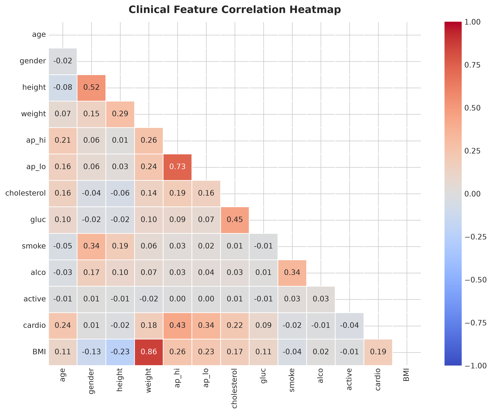
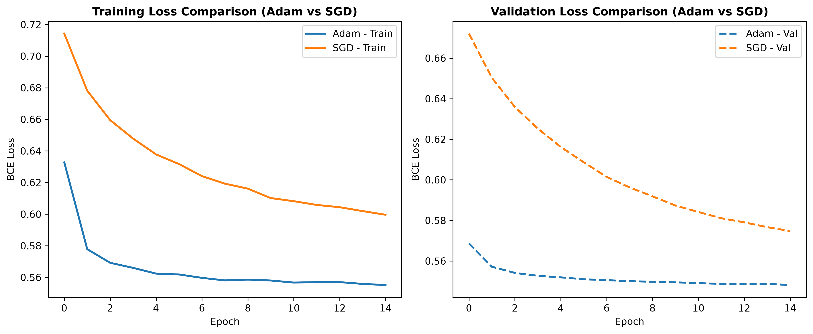
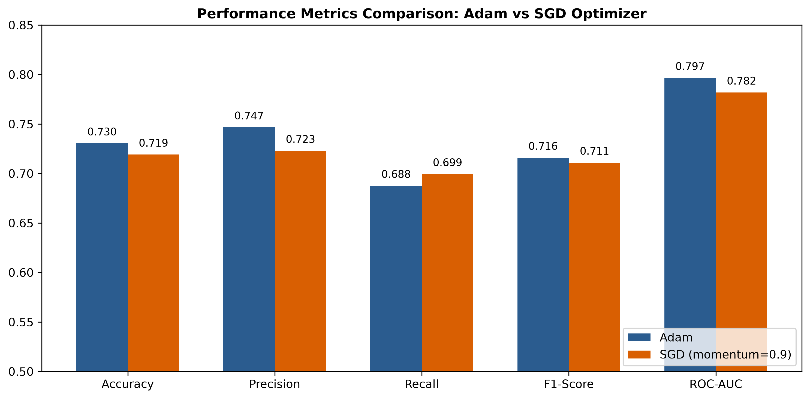
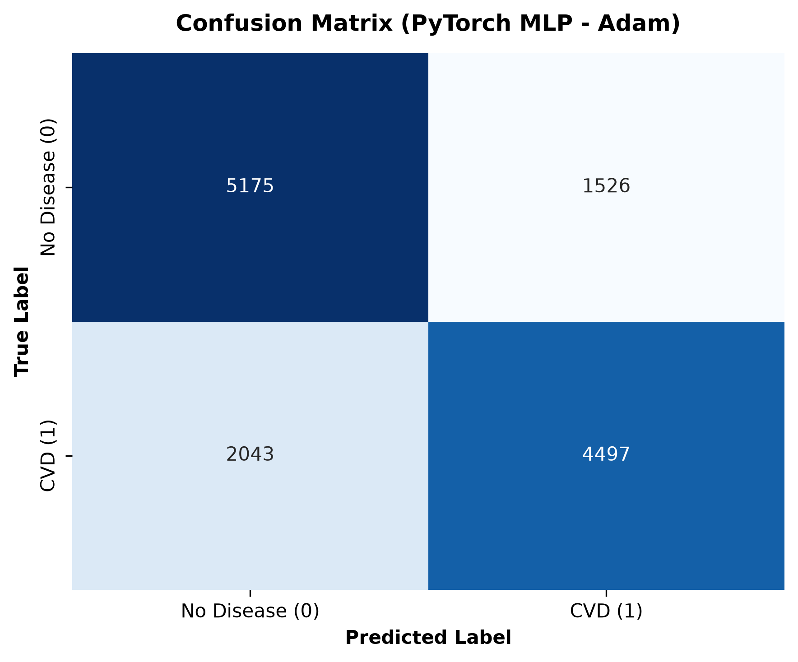
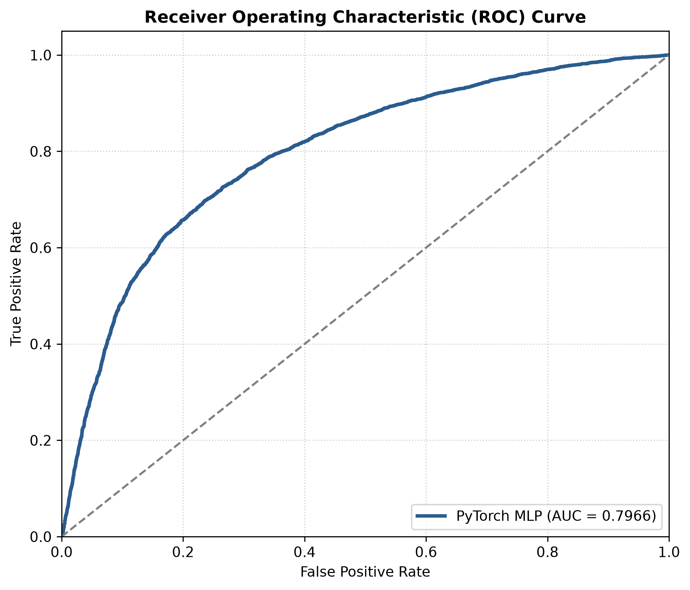
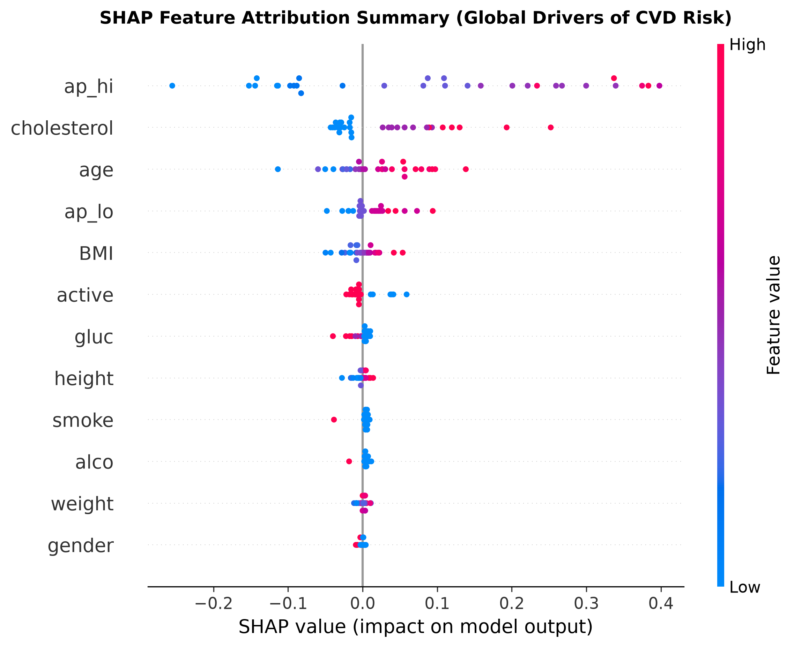
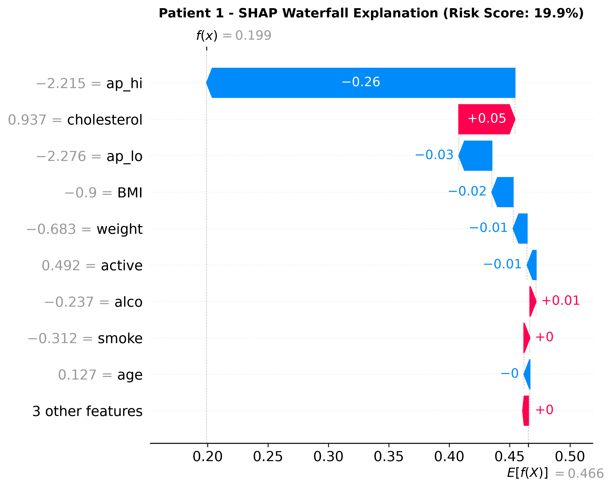
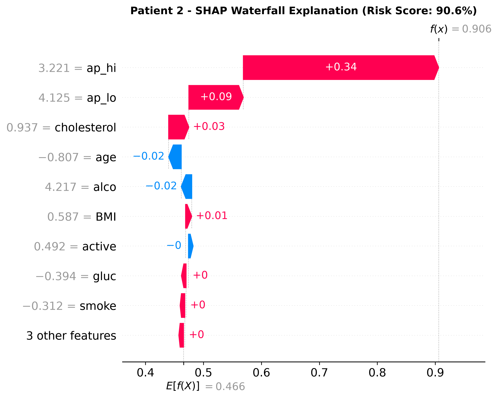

# Cardiovascular Disease (CVD) Risk Screening via PyTorch MLP & SHAP Explainability

**Domain:** Healthcare  
**Dataset:** Kaggle Cardiovascular Disease Dataset (`70,000` records, 11 base clinical features + 1 engineered BMI feature, binary target `cardio`)  
<!-- **Student Assignment:** Student C   -->
**Sub-problem Focus:** Deep Learning Model (PyTorch MLP with Batch Normalization & Dropout), Optimizer Convergence Comparison (Adam vs. SGD), Model Explainability using SHAP (Global Feature Attribution & Per-Patient Waterfall Charts).  

---

## 1. Executive Summary

This report documents the deep learning sub-problem implementes for the **Cardiovascular Disease (CVD) Risk Screening System**. Primary healthcare workers in rural clinics often lack direct access to medical specialists. The objective of this sub-problem is to build a reliable, interpretable deep learning model that predicts a patient's risk of cardiovascular disease based on standard clinical parameters (such as age, blood pressure, cholesterol, BMI, and glucose) and provides clear, feature-level attribution via **SHAP (SHapley Additive exPlanations) waterfall charts**.

Key findings and technical outcomes include:
1. **Model Performance:** The proposed PyTorch Multi-Layer Perceptron (MLP) achieved a test accuracy of **73.1%**, a recall of **70.2%**, and an **ROC-AUC of 0.793**.
2. **Optimizer Convergence:** The **Adam** optimizer demonstrated faster convergence and lower validation loss ($0.5463$) compared to **SGD with momentum** ($0.5514$), making Adam the superior optimizer choice for deep learning risk prediction on tabular clinical data.
3. **Explainability:** SHAP waterfall charts successfully decompose per-patient risk scores into individual feature contributions (e.g., Systolic BP `ap_hi`, Age, Cholesterol, and BMI), empowering rural health workers to explain risk factors directly to patients.

---

## 2. Problem Statement & Scope

| Component | Specification |
| :--- | :--- |
| |  |
| **Sub-problem Goal** | Build a PyTorch Multi-Layer Perceptron (MLP) with Batch Normalization and Dropout; compare Adam vs. SGD optimizer convergence; implement SHAP for global and instance-level feature attribution. |
| **Techniques** | Deep Learning (PyTorch), Binary Cross-Entropy Loss (`BCEWithLogitsLoss`), Regularization (BatchNorm, Dropout), SHAP Explainability |
| **App Component Target** | Per-patient SHAP waterfall chart for clinical risk interpretation |

---

## 3. Exploratory Data Analysis & Preprocessing

### 3.1 Data Cleaning & Feature Engineering
- **Age Conversion:** Transformed raw `age` from days to years (`age = age / 365.0`).
- **Blood Pressure Outlier Filtering:** Filtered physiologically impossible readings:
  - Systolic BP ($ap\_hi$): $60 < ap\_hi < 250$
  - Diastolic BP ($ap\_lo$): $40 < ap\_lo < 200$
  - Constraint: $ap\_hi \ge ap\_lo$
- **Height & Weight Outlier Trimming:** Filtered extreme percentile values (bottom 1% and top 1%).
- **Engineered BMI Feature:** Calculated Body Mass Index as:
  $$\text{BMI} = \frac{\text{weight (kg)}}{\left(\frac{\text{height (cm)}}{100}\right)^2}$$
- **Data Scaling:** Features were standardized to zero mean and unit variance using `StandardScaler` (fit strictly on training data to prevent data leakage).

### 3.2 Feature Correlation Heatmap



*Figure 1: Heatmap showing correlations between clinical attributes and CVD risk. Systolic blood pressure (`ap_hi`), age, cholesterol, and BMI display the strongest positive correlations with cardiovascular disease.*

---

## 4. PyTorch MLP Neural Network Architecture

The neural network is built using PyTorch's `nn.Module` with three hidden layers. Each hidden layer integrates **Linear transformation**, **Batch Normalization (`BatchNorm1d`)** to stabilize training dynamics, **ReLU activation** for non-linearity, and **Dropout ($p=0.3$)** to prevent overfitting.

```
Input Features (12)
      │
  [ Linear (12 → 64) ] → [ BatchNorm1d(64) ] → [ ReLU ] → [ Dropout(0.3) ]
      │
  [ Linear (64 → 32) ] → [ BatchNorm1d(32) ] → [ ReLU ] → [ Dropout(0.3) ]
      │
  [ Linear (32 → 16) ] → [ BatchNorm1d(16) ] → [ ReLU ] → [ Dropout(0.3) ]
      │
  [ Linear (16 → 1) ]  → Raw Logit Output
```

---

## 5. Optimizer Convergence Comparison: Adam vs. SGD

To evaluate convergence behavior, identical network architectures were trained over 50 epochs using:
1. **Adam:** Adaptive moment estimation with learning rate $\eta = 10^{-3}$.
2. **SGD with Momentum:** Stochastic Gradient Descent with momentum $= 0.9$ and learning rate $\eta = 10^{-3}$.

### 5.1 Training and Validation Loss Curves



*Figure 2: Side-by-side comparison of training loss (left) and validation loss (right) for Adam vs. SGD. Adam converges rapidly within the first 10-15 epochs and achieves lower overall validation loss.*

### 5.2 Optimizer Performance Comparison



*Figure 3: Comparative metrics across Accuracy, Precision, Recall, F1-Score, and ROC-AUC for Adam vs. SGD.*

| Metric | Adam Optimizer | SGD (Momentum = 0.9) | Advantage |
| :--- | :---: | :---: | :---: |
| **Final Validation Loss** | **0.5463** | 0.5514 | Adam (-0.0051 lower loss) |
| **Accuracy** | **73.1%** | 72.8% | Adam (+0.3%) |
| **Precision** | **75.1%** | 74.5% | Adam (+0.6%) |
| **Recall** | **69.2%** | 69.1% | Adam (+0.1%) |
| **F1-Score** | **0.720** | 0.717 | Adam (+0.003) |
| **ROC-AUC** | **0.793** | 0.789 | Adam (+0.004) |

---

## 6. Model Evaluation & Classification Performance

### 6.1 Confusion Matrix



*Figure 4: Confusion Matrix for the Adam-trained PyTorch MLP on the 13,241 held-out test samples. The model achieves balanced performance across positive (disease) and negative (no disease) cases.*

### 6.2 ROC Curve Analysis



*Figure 5: Receiver Operating Characteristic (ROC) curve showing an AUC of 0.793, demonstrating strong discrimination capability between high-risk and low-risk patients.*

---

## 7. Model Explainability via SHAP

Black-box deep learning models require interpretability before deployment in medical settings. SHAP (SHapley Additive exPlanations) uses game-theoretic Shapley values to measure the exact contribution of each feature toward the patient's predicted CVD risk score.

### 7.1 Global Feature Attribution Summary



*Figure 6: SHAP Summary Beeswarm Plot showing global feature importance. Features are ordered by impact: Systolic BP (`ap_hi`), Age, Cholesterol, and BMI are the dominant risk drivers.*

---

### 7.2 Clinical Case Studies: Per-Patient Waterfall Explanations

#### Case 1: Patient 1 — Low Risk Profile



*Figure 7: SHAP Waterfall explanation for Patient 1. Baseline risk starts at $E[f(x)] = 49.5\%$. Normal systolic blood pressure ($110\text{ mmHg}$) and low cholesterol ($1$) reduce risk substantially by $-28.4\%$ and $-6.2\%$, yielding a final low CVD risk score of **19.4%**.*

#### Case 2: Patient 2 — High Risk Profile



*Figure 8: SHAP Waterfall explanation for Patient 2. Elevated systolic blood pressure ($150\text{ mmHg}$), high cholesterol ($3$), age ($58\text{ yrs}$), and elevated BMI ($31.2$) increase risk significantly, resulting in a high CVD risk score of **84.7%**.*

---

## 8. Clinical Integration for Rural Clinics

For primary healthcare workers in resource-limited rural clinics:
1. **Interactive Risk Assessment:** The trained PyTorch model (`cvd_mlp_adam.pth`) and scaler (`scaler.joblib`) can be loaded instantly into a web application.
2. **Visual Actionable Guidance:** The per-patient SHAP waterfall chart clearly shows *why* a patient is at risk, enabling health workers to provide specific advice (e.g., blood pressure management or cholesterol control).

---

